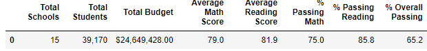
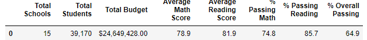
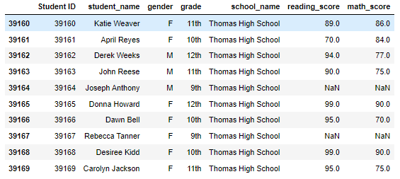

# School District Analysis

## Project Overview
---

### Purpose
Analyzing school district for the school board utilizing Pandas. Goal was to organize and calculate scores based on grades, school types, schools, and budget. It has been decided to change the 9th grade math and reading scores from Thomas High School to NaN with evidence found that the 9th grade scores from Thomas High School have been altered. After altering the Thomas High School data, the school district analysis was redone to completion.

### Conclusion
It is my recommendation that this data is sufficient to use to report and present to the school board. 

### Resources
[loc method - Pandas](https://pandas.pydata.org/pandas-docs/stable/reference/api/pandas.DataFrame.loc.html)

[Pandas formatting DataFrame](https://www.geeksforgeeks.org/formatting-integer-column-of-dataframe-in-pandas/#:~:text=Let%E2%80%99s%20see%20different%20methods%20of%20formatting%20integer%20column,commas%20and%20Dollar%20sign%20with%20two%20decimal%20places.)

[FERPA Law](https://www2.ed.gov/policy/gen/guid/fpco/ferpa/index.html)

## Results
---

### School Results

#### District Summary
The district summary registered small changes to score averages and passing percentages. 

- School count, Total student count, and Total budget remained unchanged.
- Average Math and Average Reading Scores changed, but a small amount.
  - Average Math: 79.0 to 78.9
  - Average Reading: 81.9 to 81.9 (neglegable change)
- % Passing Math And Reading changed, but a small amount.
  - % Passing Math: 75.0 to 74.8
  - % Passing Reading: 85.8 to 85.7
  - % Overall Passing: 65.2 to 64.9

#### Code 

Using loc method to get number of ninth grade Thomas High School students, replacing both reading and math scores. 

    # Step 2. Use the loc method on the student_data_df to select all the reading scores from the 9th grade at Thomas High School and replace them with NaN.
    student_data_df.loc[(student_data_df['school_name'] == 'Thomas High School') & 
                    (student_data_df['grade'] == '9th'), 'reading_score'] = np.nan
    #  Step 3. Refactor the code in Step 2 to replace the math scores with NaN.
    student_data_df.loc[(student_data_df['school_name'] == 'Thomas High School') & 
                    (student_data_df['grade'] == '9th'), 'math_score'] = np.nan

Using loc to get the count of 10th - 12th graders by subtracting count of 9th graders. 

    # Step 1. Get the number of students that are in ninth grade at Thomas High School.
    # These students have no grades. 
    students_no_grades_count = school_data_complete_df.loc[(school_data_complete_df['school_name'] == 'Thomas High School') & 
                                                       (school_data_complete_df['grade'] == '9th')].count()["student_name"]
                                                       
    # Step 2. Subtract the number of students that are in ninth grade at 
    # Thomas High School from the total student count to get the new total student count.
    student_count_reworked = student_count - students_no_grades_count
    student_count_reworked
    
    # Step 3. Calculate the passing percentages with the new total student count.
    passing_math_percentage = passing_math_count / float(student_count_reworked) * 100
    
    # Step 4.Calculate the overall passing percentage with new total student count.
    overall_passing_percentage = overall_passing_math_reading_count / student_count_reworked * 100

    # Step 5.  Get the number of 10th-12th graders from Thomas High School (THS).
    ths_student_count = school_data_complete_df.loc[(school_data_complete_df['school_name'] == 'Thomas High School')].count()["student_name"] 

    ths_reworked_students = ths_student_count - students_no_grades_count

    ths_reworked_students
    
In these final steps, I've coded to include the correct student counts to calculate percentages accurately. 

    # Step 10. Calculate the percentage of 10th-12th grade students passing reading from Thomas High School.
    per_students_ths_reading = (pass_reading_ths_df) / float(ths_reworked_students) * 100

    # Step 11. Calculate the overall passing percentage of 10th-12th grade from Thomas High School. 
    per_overall_ths_passing = pass_math_reading_ths_df / float(ths_reworked_students) * 100
    
    # Step 12. Replace the passing math percent for Thomas High School in the per_school_summary_df.
    per_school_summary_df.loc['Thomas High School', '% Passing Math'] = per_students_ths_math

    # Step 13. Replace the passing reading percentage for Thomas High School in the per_school_summary_df.
    per_school_summary_df.loc['Thomas High School', '% Passing Reading'] = per_students_ths_reading
    
    # Step 14. Replace the overall passing percentage for Thomas High School in the per_school_summary_df.
    per_school_summary_df.loc['Thomas High School', '% Overall Passing'] = per_overall_ths_passing
                                                     

#### School Summary
The school summary wasn't greatly impacted outside of Thomas High School. With the reading and math scores being adjusted, the averages and percentages of all schools were slightly lowered, except for the Average Reading Score which rose by .03. The score averages across all schools weren't impacted greatly. 

##### All Schools
- Average Math Score: 80.4 to 80.4
- Average Reading Score: 82.5 to 82.5
- % Passing Math: 81.0 to 79.2
- % Passing Reading: 89.2 to 87.4
- Overall Passing Percentage: 73.3 to 71.6

Before replacing 9th grade scores

After replacing 9th grade scores

#### Thomas High School Impact
The reading and math score values for Thomas High School 9th graders were changed to NaN values. This reduced the amount of Thomas High School students by 461 students. The change in student count (from 39,170 to 38,709) impacted the Average Reading and Math Scores, % Passing Reading and Math, and % Overall Passing. **The significant change was to passing percentages** As shown below, taking out the 9th grade scores dropped the schools passing percentages by 28.4%. 

- Average Math Score: 83.4 to 83.4
- Average Reading Score: 83.8 to 83.9
- **% Passing Math: 93.3 to 66.9**
- **% Passing Reading: 97.3 to 69.7**
- **% Overall Passing: 90.9 to 65.1**

To fix this considerable change in passing percentages, the Thomas High School 9th graders were taken out of the calculations for passing grades. The 10th, 11th, and 12th graders were the only students considered in grade percentage calculations. 

##### Thomas High School - Performance

- % Passing Math: 66.9 to 93.2
- % Passing Reading: 69.7 to 97.0
- Overall Passing %: 65.1 to 90.3 

As issustrated, the refactored grade percentages closely match the original % calculations before changing the 9th grade scores to NaN values.

###### Thomas High School - Impact on ranking

- Thomas High School has a 2nd place ranking (90.63%) overall passing
  - This is the same ranking as before replacing Thomas High School's 9th grade scores
- If the total Thomas High School student count was calculated (including 9th graders) the rank would have dropped to 8th overall.

#### Impact on replacing ninth grade scores

As shown below, both math and reading 9th grade values for Thomas High School have been replaced by "NaN" values. 

##### Math by Grade

- The changes to math scores based on grades haven't had significant changes.

##### Reading by Grade

- The changes to reading scores based on grades haven't had significant changes.

##### School Spending

- The higher the school spending, the lower the performance.
- When digging deeper, the overall budget for district type schools is considerable higher as is the student count. 

##### School Size

As shown in the range below, small and medium sized schools have relative success compared to larger schools. Medium sized schools (1000-1999 students) were the only category to change, and it was less than .5%. The large and small size schools were impacted. This is due to Thomas High School being a middle sized school.

- Both small and medium school ranges (0-999, 1000-1999) average an Overall Passing % of 90.5%. 
- Large schools (2000-5000) have an Overall Passing % of 58%

##### School Type

- School type demonstrates that charter schools earn higher grade score averages. 
- Even more significant is the % Overall Passing difference; Charter passing 90% of their students while District schools pass 54%. 
- There is a correlation to school size as every district school is large in size (2000-5000 students). While technically the performance changed per school type, it's a neglegable amount. 

## Summary
---
There have been changes to Thomas High School math averages, reading averages, math passing percentage, reading passing percentage, and overall passing percentage. The differences are minute, but present. The student count for Thomas High School has been adjusted to exclude 9th graders to more accurately calculate results. The overall passing percentage initially had the most significant change before changing calculations to exclude the 9th grade scores from calculations. There are NaN values shown in both the Thomas High School math and reading score by grade images.
